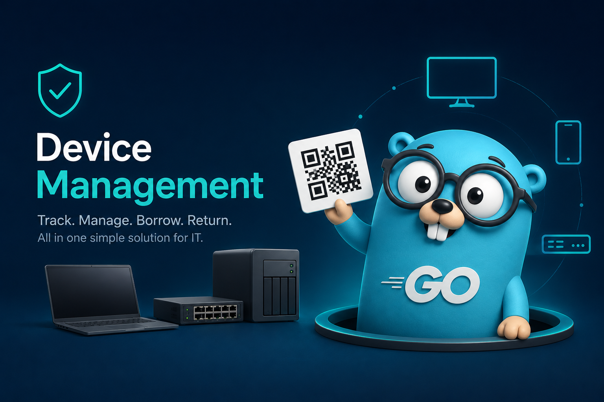

# Device Management System



This is a useful device management for IT.

## Develop Environment

| DevOpts | Version |
| - | - |
| OS | Ubuntu 25.04 |
| go | 1.26.2 |
| nodejs | v20.20.0 |
| yarn | 1.22.22 |

## Make

| Type | Command |
| - | - |
| Make all | `make` |
| Backend | `make backend` |
| Frontend | `make frontend` |
| Run | `make run` |
| Tidy | `make tidy` |
| Lint | `make lint` |
| Test | `make test` |
| Docker Image | `make docker` |

## API Level

```bash
/api
    └─/login(POST)
    └─/logout(POST)
    └─/category(GET, POST)
    │   └─/:cate(GET, DELETE)
    └─/device(POST)
    │   └─/:cate(GET)
    │   └─/:cate/:dev(GET, DELETE)
    └─/qrcode/:cate/:dev(POST, DELETE)
```

## Install - Docker Compose

1. Clone the repo & install Docker

    ```bash
    git clone https://github.com/Alonza0314/dm-system.git
    cd dm-system
    sudo ./docker/install-docker.sh
    ```

2. Check then config

    Admin can modify systemm setting at [./docker/config.yaml](./docker/config.yaml), e.g. the default login credential:

    ```yaml
    username: "admin"
    password: "0000"
    ```

    For other setting, please make sure the modification is match the setting at [docker-compose.yaml](docker-compose.yaml).

3. Up the compose

    ```bash
    docker compose up
    ```

    The default db will be stored at `/var/lib/dm/` which is mounted in the compose file.

4. Down the compose

    ```bash
    docker compose down
    ```

## Integration Test

In `integration-test` folder, there provides a `test.sh` script for test each API with using `-t` parameter.

```bash
cd integration-test
```

Now, there are some tests:

```bash
./test.sh -t TestApiAccount
./test.sh -t TestApiCategory
./test.sh -t TestApiDevice
./test.sh -t TestApiQrcode
```

## DB

| Collection | Key | Value | Note |
| - | - | - | - |
| ID | `category`, `device` | number | unique ID for category and device |
| category | category_name | [Category](./backend/model/category.go) | category list |
| category-* | device_name | [Device](./backend/model/device.go) | device under target category |
